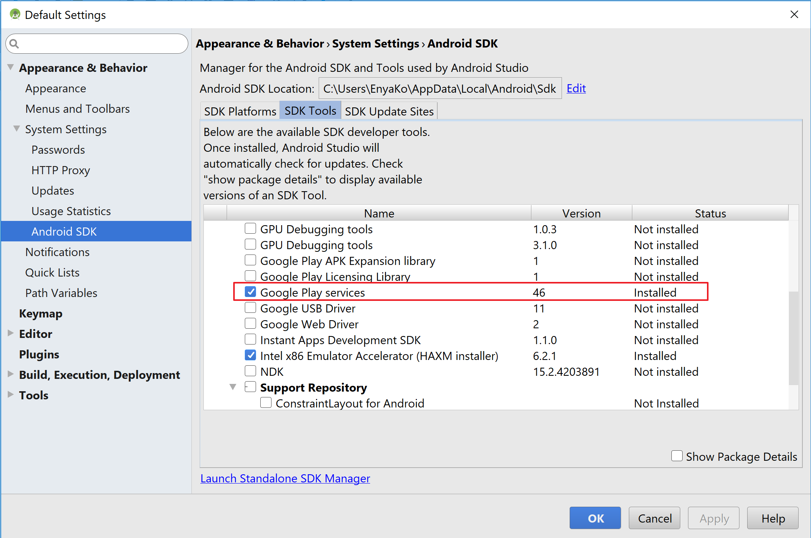
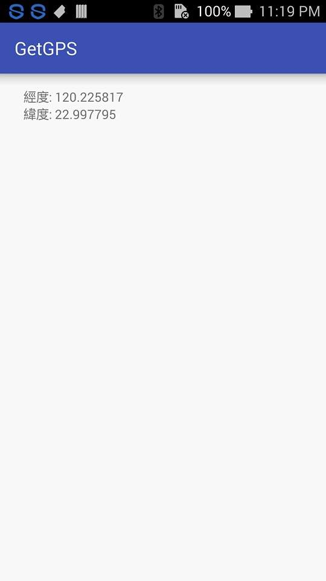

Get GPS location with Android Studio

# On the Device
Android version: versions after 2.3.3(API 10)

Installed Google Play 

# On Android Studio

### Install Google Play services 

### add the following line in file build.gradle, and click on Sync Project with Gradle Files
compile 'com.google.android.gms:play-services-location:8.1.0'

### add the following lines in file AndroidManifest.xml
\<uses-permission android:name="android.permission.ACCESS_FINE_LOCATION"/>\
\<uses-permission android:name="android.permission.ACCESS_COARSE_LOCATION"/>

# Result
location is stored in two variables(type: double):
- latitude
- longtitude

/***note that this program get GPS location when the program starts; it will not update the location until finishing the program***/
